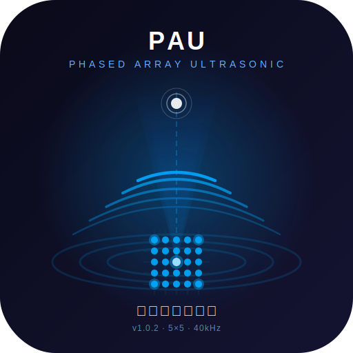

<p align="center">
  
</p>

<h1 align="center">超声阵列控制台</h1>

<p align="center">
  <strong>Ultrasonic Array Console</strong><br>
  5×5 相控阵超声波上位机 — COM 串口 + BLE 蓝牙双模通信
</p>

<p align="center">
  
  
  
  
  
</p>

---

## 📑 目录

- [功能特性](#-功能特性)
- [技术架构](#-技术架构)
- [安装与运行](#-安装与运行)
- [快速上手](#-快速上手)
- [任务模式](#-任务模式)
- [项目结构](#-项目结构)
- [通信协议](#-通信协议)
- [API 服务器](#-api-服务器)
- [开发指南](#-开发指南)
- [贡献](#-贡献)
- [许可证](#-许可证)
- [致谢](#-致谢)

---

## ✨ 功能特性

### 🔌 双模通信
- **COM 串口**：通过 `serialport` 直连硬件，支持自定义波特率
- **BLE 蓝牙**：基于 Web Bluetooth API，无线连接 BLE 模块（服务 UUID `0xFFE0`）
- 自动端口发现与热插拔检测

### 🎯 波束控制
- **加窗偏转**（Task 1）：远场波束方向图，θX/θY ±30° 扫描
- **距离聚焦**（Task 2）：近场焦点控制，100–1800mm 可调
- **功率聚焦**（Task 3）：驱动功率优化，支持最大压力/平衡聚焦/等 RMS 三种策略
- 4 种窗函数：平坦 / Stage2 / Hann / Hamming
- 两种功率策略：峰值限制 / 等 RMS 归一化

### 📊 三维可视化
- **3D 曲面**：声压强度映射为曲面高度 + HSL 色彩（蓝→红）
- **2D 平面**：俯视热力图，快速预览声场分布
- **3D 体积**：多层半透明热力图堆叠，展示声场三维传播过程
- 基于 Three.js，支持 OrbitControls 交互旋转、缩放

### 🔧 硬件协议
- UART 帧格式：`@TT|AA|BB|CC#`（13 字符 ASCII）
- 四步任务流程：握手 → 幅度数据 → 相位数据 → 应用命令
- 25 通道相位/幅度独立控制（5×5 阵列，40kHz 载波）
- 动态占空比流模式（stream）与远程控制开关

### 🖥️ 工程化
- 基于 [electron-vite](https://electron-vite.org/) 构建，三进程分离架构
- 内置 HTTP REST API 服务器（端口 3333），支持浏览器独立访问
- Windows 便携版打包（免安装 `.exe`）

---

## 🏗️ 技术架构

```
┌──────────────────────────────────────────────────────┐
│                    Electron App                       │
│  ┌────────────┐  ┌────────────┐  ┌────────────────┐  │
│  │  Main       │  │  Preload   │  │  Renderer      │  │
│  │  Process    │  │  Script    │  │  Process       │  │
│  │             │  │            │  │                │  │
│  │  Protocol   │◄─┤  context-  │─►│  Three.js      │  │
│  │  Serial/BLE │  │  Bridge    │  │  3D Render     │  │
│  │  IPC        │  │            │  │  Beam Compute  │  │
│  │  HTTP Server│  │            │  │  UI Controls   │  │
│  └──────┬─────┘  └────────────┘  └────────────────┘  │
│         │                                             │
│    ┌────▼────┐                                        │
│    │ FPGA    │  UART @ 40kHz                          │
│    │ 5×5 PA  │  74HC595 SPI                           │
│    └─────────┘                                        │
└──────────────────────────────────────────────────────┘
```

| 层级 | 技术栈 |
|------|--------|
| 构建工具 | electron-vite 3.x + Vite 6.x + Rollup |
| 主进程 | Node.js ESM, serialport 13.x |
| 渲染进程 | Three.js 0.184, 原生 ES Modules |
| 打包 | electron-builder 25.x (portable / nsis / dmg / AppImage) |
| 通信 | UART 协议 / BLE GATT / HTTP REST |

---

## 📦 安装与运行

### 前置要求

- **Node.js** ≥ 18.x
- **npm** ≥ 9.x
- Windows 用户需安装 [USB 串口驱动](https://www.ftdichip.com/Drivers/VCP.htm)（如 FT232）

### 源码安装

```bash
# 克隆仓库
git clone [待补充]
cd Host

# 安装依赖
npm install

# 启动开发模式（热重载）
npm run dev

# 构建生产版本
npm run build

# 打包 Windows 便携版
npm run package
```

### 独立 HTTP 服务器（无需 Electron）

```bash
npm run server
# 浏览器访问 http://localhost:3333
```

### 预编译便携版

直接下载 `超声阵列控制台 1.0.2.exe`，双击运行，无需安装。

> ⚠️ Windows 便携版首次运行可能触发 SmartScreen 警告，点击"更多信息"→"仍要运行"即可。

---

## 🚀 快速上手

### 1. 启动应用

```bash
npm run dev
```

### 2. 连接硬件

1. 将 USB 串口线连接至 FPGA 板
2. 在左侧面板选择 COM 端口和波特率
3. 点击 **连接**

或使用蓝牙：

1. 点击 **BLE 扫描**
2. 在弹出的蓝牙设备列表中选择目标设备
3. 等待连接完成

### 3. 调整波束参数

- 选择任务模式（偏转 / 聚焦 / 功率聚焦）
- 拖动滑块调整角度或焦距
- 选择窗函数和功率策略
- 中央 3D 视图实时预览声场

### 4. 下发到硬件

点击 **应用** 按钮，完成四步协议流程：

```
握手 → 发送 25 通道幅度 → 发送 25 通道相位 → 应用命令
```

---

## 🎛️ 任务模式

| 模式 | 标签 | 说明 | 默认参数 |
|------|------|------|----------|
| Task 1 | 加窗偏转 | 远场波束方向图，通过角度控制偏转 | θX=12°, θY=0°, Stage2 窗 |
| Task 2 | 距离聚焦 | 近场焦点控制，指定焦距 | 焦距=800mm, Stage2 窗 |
| Task 3 | 功率聚焦 | 在功率约束下优化焦点压力 | 焦距=800mm, 策略=平衡聚焦 |

### 预设参数

每个任务模式提供多个快速预设按钮，一键切换常用配置。

### 视图模式

| 模式 | 说明 | 适用任务 |
|------|------|----------|
| 3D 曲面 | 声压映射为曲面高度 + 色彩 | 全部 |
| 2D 平面 | 俯视热力图 | 全部 |
| 3D 体积 | 多层半透明平面堆叠 | Task 2 / Task 3 |

---

## 📁 项目结构

```
Host/
├── src/
│   ├── main/                      # 主进程
│   │   ├── index.js               # 应用入口
│   │   ├── windowManager.js       # 窗口管理
│   │   ├── ipc/                   # IPC 处理器
│   │   │   ├── serial.handlers.js # 串口 IPC
│   │   │   ├── beam.handlers.js   # 波束 IPC
│   │   │   └── ble.handlers.js    # 蓝牙 IPC
│   │   ├── protocol/              # 硬件通信协议
│   │   │   ├── frame.js           # 帧编解码
│   │   │   ├── transport.js       # 传输层（串口/BLE）
│   │   │   └── port-discovery.js  # 端口发现
│   │   └── server/                # HTTP API 服务器
│   │       ├── index.js           # 服务器启动
│   │       ├── routes.js          # REST 路由
│   │       └── standalone.js      # 独立运行入口
│   ├── preload/
│   │   └── main.preload.js        # contextBridge 注入
│   └── renderer/                  # 渲染进程
│       ├── modules/
│       │   ├── beam/              # 波束计算
│       │   │   ├── field.js       # 声场计算（远场/聚焦/体积）
│       │   │   ├── phase.js       # 相位表生成
│       │   │   └── window.js      # 窗函数与幅度
│       │   ├── render/            # Three.js 渲染
│       │   │   └── beam-canvas.js # 3D 声场可视化
│       │   ├── bridge.js          # 环境检测与 API 桥接
│       │   ├── connection.js      # 连接管理
│       │   └── constants.js       # 物理常数与任务定义
│       └── pages/main/
│           ├── index.html         # 页面入口
│           └── *.css              # 样式文件
├── config/                        # 环境配置
├── electron.vite.config.js        # 构建配置
├── electron-builder.yml           # 打包配置
└── package.json
```

---

## 📡 通信协议

### UART 帧格式

```
@TT|AA|BB|CC#
 │   │  │  │
 │   │  │  └─ 参数 CC（2 位 HEX）
 │   │  └──── 参数 BB（2 位 HEX）
 │   └─────── 参数 AA（2 位 HEX）
 └─────────── 地址 TT（2 位 HEX）
```

### 任务流程

```
Host                          FPGA
  │                             │
  │── 握手 (TT=taskId) ───────►│
  │◄── 响应 (bb=幅度数, cc=相位数) ──│
  │                             │
  │── 幅度数据 ×N ────────────►│
  │── 相位数据 ×N ────────────►│
  │── 应用命令 ───────────────►│
  │◄── 确认响应 ───────────────│
```

### 物理常数

| 参数 | 值 | 说明 |
|------|-----|------|
| 阵列规模 | 5×5 | 25 通道 |
| 阵元间距 | 16 mm | PITCH_M |
| 载波频率 | 40 kHz | CARRIER_HZ |
| 声速 | 343 m/s | SPEED_OF_SOUND |
| 波长 | 8.575 mm | WAVELENGTH_M |
| 波数 | 732.8 rad/m | WAVE_NUMBER |

---

## 🌐 API 服务器

内置 HTTP 服务器在端口 **3333** 提供 REST API，支持浏览器直接访问（无需 Electron）。

| 方法 | 端点 | 说明 |
|------|------|------|
| GET | `/api/ports` | 获取可用串口列表 |
| GET | `/api/connection` | 获取当前连接状态 |
| POST | `/api/connect` | 连接串口 `{ path, baudRate }` |
| POST | `/api/disconnect` | 断开连接 |
| POST | `/api/apply` | 应用波束任务 `{ taskId, phaseTable, ampTable }` |
| POST | `/api/status` | 查询 FPGA 状态 |
| POST | `/api/duty-limit` | 设置占空比上限 `{ taskId, value }` |
| POST | `/api/duty-limit-stream/start` | 启动占空比流模式 |
| POST | `/api/duty-limit-stream/bytes` | 批量发送占空比字节 `{ values }` |
| POST | `/api/duty-limit-stream/stop` | 停止占空比流模式 |
| POST | `/api/disable-remote` | 关闭远程控制 |

### 示例

```bash
# 获取串口列表
curl http://localhost:3333/api/ports

# 连接串口
curl -X POST http://localhost:3333/api/connect \
  -H "Content-Type: application/json" \
  -d '{"path": "COM3", "baudRate": 115200}'

# 查询状态
curl -X POST http://localhost:3333/api/status
```

---

## 🛠️ 开发指南

### 脚本命令

| 命令 | 说明 |
|------|------|
| `npm run dev` | 启动开发模式（Electron + 热重载） |
| `npm run build` | 构建生产版本（输出到 `out/`） |
| `npm run package` | 构建 + 打包 Windows 便携版 |
| `npm run preview` | 预览构建产物 |
| `npm run server` | 启动独立 HTTP 服务器 |
| `npm run check` | 语法检查所有主进程文件 |
| `npm run lint` | ESLint 代码检查 |
| `npm run format` | Prettier 格式化 |

### 环境配置

配置文件位于 `config/` 目录：

| 文件 | 用途 |
|------|------|
| `env.dev.json` | 开发环境配置 |
| `env.prod.json` | 生产环境配置 |
| `env.test.json` | 测试环境配置 |

---

## 🤝 贡献

欢迎提交 Issue 和 Pull Request！

1. Fork 本仓库
2. 创建功能分支：`git checkout -b feature/my-feature`
3. 提交更改：`git commit -m "feat: add my feature"`
4. 推送分支：`git push origin feature/my-feature`
5. 提交 Pull Request

> 💡 提交前请运行 `npm run lint` 确保代码风格一致。

---

## 📄 许可证

本项目基于 [MIT License](LICENSE) 开源。

---

## 👏 致谢

- **作者**：EternoPax
- **框架**：[Electron](https://www.electronjs.org/) · [electron-vite](https://electron-vite.org/)
- **可视化**：[Three.js](https://threejs.org/)
- **串口通信**：[serialport](https://serialport.io/)
- **蓝牙**：[Web Bluetooth API](https://developer.mozilla.org/en-US/docs/Web/API/Web_Bluetooth_API)

---

<p align="center">
  如果这个项目对你有帮助，请给一个 ⭐️
</p>
